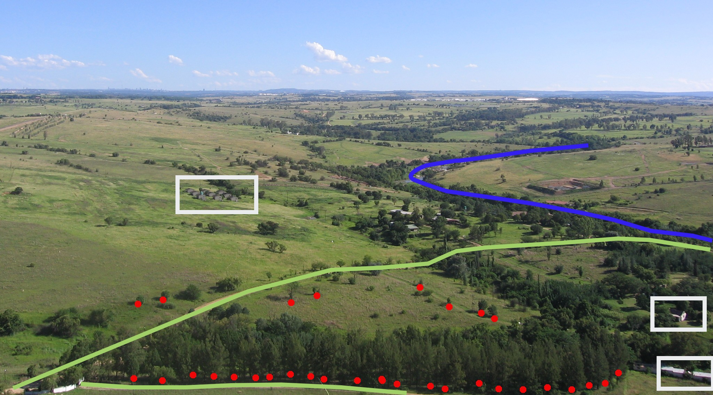
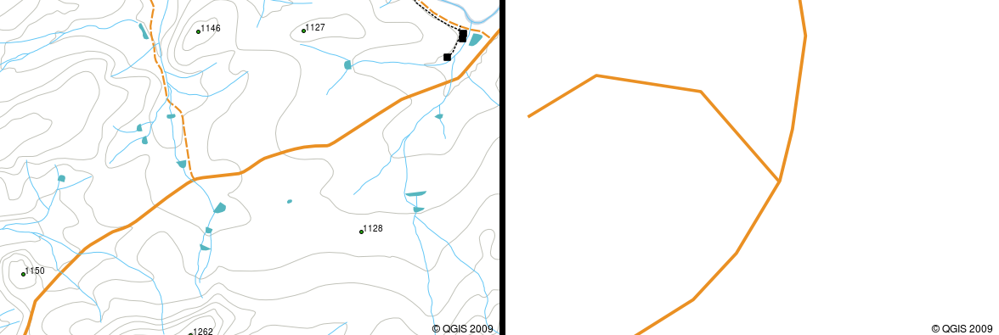
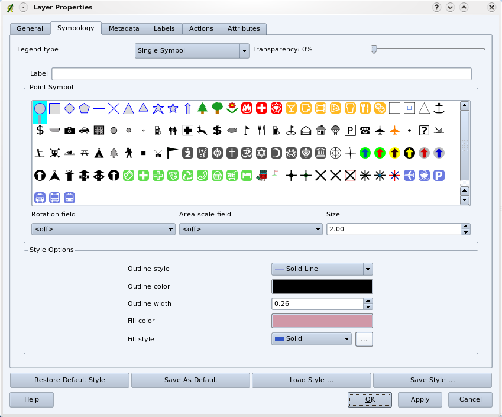
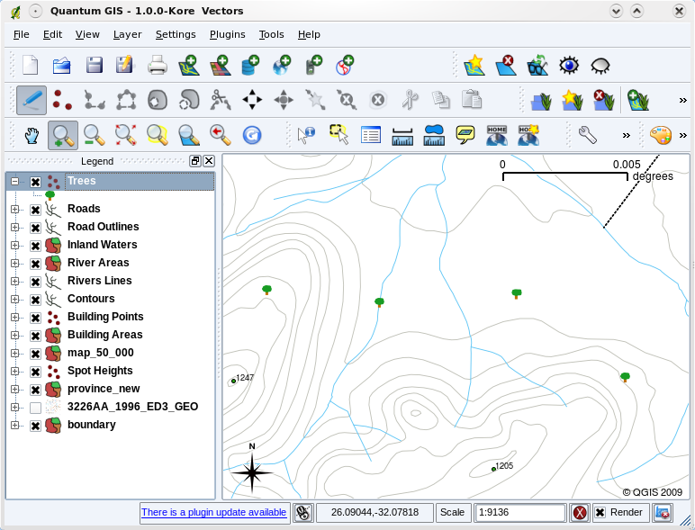
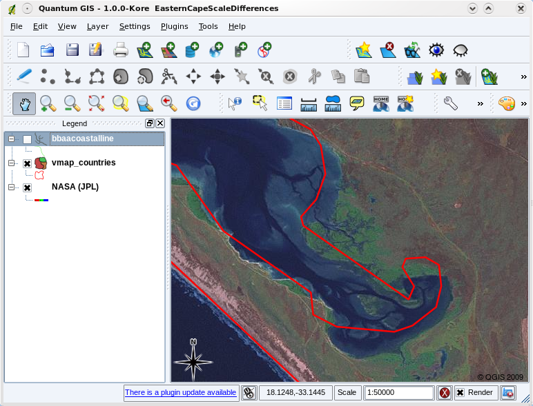
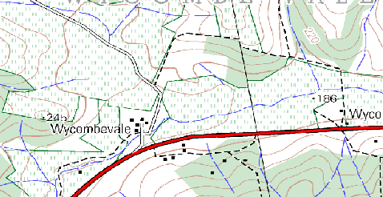

# Векторни данни

## Преглед

**Векрните данни** в ГИС позволяват изобразяването на **обекти** от заобикалящата ни среда. **Обект** може да бъде всичко около нас. Представете си, че сте на някое високо място. Като се огледате наоколо, виждате дървета, реки, пътища, поля, сгради, селища и т.н. Всяко от тези неща би било "обект", когато го представяме в ГИС среда. Всеки отделен обект може да има **атрибути**, които са допълнителна информация, най-често като текст и числа, която **описва** обекта.

Формата на векторния обект се представя чрез неговата **геометрия**. Векторната геометрия се състои от последователно свързани точки, наречени **вертекси**. Вертексът описва позицията на дадена точка, като съхранява координатите по осите **X**, **Y** и незадължително **Z**. Възможно е да се запишат и други данни за всеки вертекс, но тази функционалст се ползва далеч по-рядко.

Когато геометрията на обекта съдържа един единствен вертекс, то геометрия се нарича **точка**. Когато геометрията се състои от два или повече вертекса, като първия и последния не съвпадат, то става дума за **линия**. Когато геометрията се състои от четири или повече вертекса, при които първия и последния съвпадат, получения затворен многоъгълник се нарича **полигон**.

Ако погледнем отново на панорамната снимка от по-рано и въоръжени със знание за начина по който съхраняваме обекти в ГИС, лесно можем да си представим различните данни в компютъра.

## Още за точковите обекти

Трябва да сме наясно, че изборът на точки за представяне на обекти е приближение на реалността и е изцяло субективно решение на автора на данните. Основните причини да предпочетем точки са мащаба на картата, удобството за работа и вида на обектите. Например на дребномащабна карта (напр. карта на България), селищата ще бъдат представени най-вероятно като точки. Когато обаче представяме в по-едър мащаб (напр. карта на община или град), обхвата на селищата ще се представят най-вероятно като полигони. Ако ние ръчно трябва да изчертаем обектите, най-вероятно ще предпочетем точки където е възможно, защото изисква много пъти по-малко усилие, отколкото полигоните (един вертекс срещу три и повече). А и не на последно място, ако показваме местоположението на улични стълбове, просто няма смисъл да ги представяме като полигони.

Както вече коментирахме, точковите обекти имат X, Y и евентуално Z стойност.  Стойностите за X и Y ще зависят от **координатната система** (КС). Ще разгледаме координатните системи много по-подробно в следващите глави, а засега нека просто приемем, че записаните стойности запазват с точност местоположението на дадената точка. Най-разпространения вариант за това е използването на **географска дължина и ширина**. 

Линиите, които описват географската дължина се наричат **меридиани** и преминават по повърхността на Земята от единия до другия полюс. Един от тези меридиани се нарича за **главен меридиан** и всички точки, които лежат на главния меридиан имат географска дължина 0 градуса за географска дължина, тези на изток положителна стойност до 180 градуса, а тези на запад отрицателна стойност до -180 градуса. Линиите, които описват географската ширина се наричат **паралели** и обикалят земното кълбо перпендикулярно на меридианите. Главния паралел се нарича **екватор** и всички точки на екватора имат географска ширина 0 градуса, тези на север положителна стойност до 90 градуса на **северния полюс**, а тези на юг отрицателна до -90 градуса на **южния полюс**.

С това бързо и непълно въведение в географските координатни системи, можем да се досетим че при наличие на стойности за географската дължина (X) и ширина (Y), можем да определим с абсолютна точност позицията на всяка една точка на земната повърхност. Така само с две числа може да отбележим къде се намира дадено дърво, уличен стълб или самите ние.

Въпреки набиращото популярност движение, Земята не е плоска и в някои ситуации може да съхраним и стойността на измерената надморска височина (Z).

## Още за линейните обекти

Ако точката се състои от само един вертекс, то **линията има два или повече вертекса**. Линията е непрекъснатата следа, оставена при последователното свързване на вертексите. Когато два вертекса се свържат се получава **сегмент**, когато много сегменти се свържат се получава **линия**.

Линиите се използват за съхранение на геометрията на **линейни обекти**, а такива са реки, пътища, следи от преминаване, граници, хоризонтали на релефа и т. н. Понякога следваме специални правила освен дефиницията за линия. Например ако имаме карта на хоризонталите на релефа, то хоризонталите може да се допират (напр. много стръмен склон), но никога не могат да се пресичат. Подобно при карта на пътищата всеки пътен участък трябва да започне и свърши на кръстовище. В някои ГИС програми тези правила могат да се зададат като допълнително ограничение и програма сама ще съблюдава за спазването им.

Ако линията прави завой, но има прекалено големи разстояния между съседните вертекси, тя ще изглежда много **ъгловата** при по-едри мащаби. Затова е важно при създаването на нов линеен обект да слагаме достатъчно вертекси при завоите според нуждите на мащаба.

<!-- TODO това малко ни в клин, ни в ръкав тук, трябва да се измести сякаш -->
Атрибутите на линейните обекти описват свойствата му. Така за слой с пътища може да имаме атрибут за пътната настилка - павета или асфалт, или пък за броят ленти в посока, или пък дали е еднопосочка и т. н. Благодарение на тези атрибути може да визуализираме слоя с подхощят цвят и дебелина на линията.

## Още за полигонните обекти

Полигоните са **затворени площи** като язовири, острови, общински граници и др. Както линиите, така и полигоните се създават от поредица от вертекси, които са свързани в непрекъсната линия. Разликата е там, че първия и последния вертекс при полигоните са на едно и също място, за да може фигурата да се затвори. Често полигоните имат **споделена геометрия** - границата със съседния полигон съвпада. Например при два полигона за държавите Румъния и България, и двата полигона ще има поредица от вертекси, които напълно ще съвпадат по протежение на общата държавна граница. В следващите глави ще разгледаме този случай в подробности.

Също като точките и линиите, така и полигонните обекти имат **атрибути**. Атрибутите описват всеки полигон, например името на държавата, дълбочината на язовира, вида на гората и др.

## Векторни слоеве

След като си обяснихме какво са векторните данни, нека разгледаме тяхното приложение в ГИС. Повечето ГИС приложения групират векторните обекти в **слоеве**. Всички обекти в един слой имат една и съща геометрия (т.е. винаги са или само точки, или само линии, или само полигони) и имат еднакъв брой и имена на атрибутите (напр. всички обекти имат атрибута вид на дървото, ако става дума за слой с дървета). Ако събрали информация за дърветата в града като точкови обекти, всички те ще се заредят като един слой в ГИС. Това е удобно, защото може да настроим визуализацията на всички обекти едновременно, да ги показваме и скриваме и като цяло да работим с тях като една логическа група.

## Редакция на векторни данни

ГИС програмите позволяват създаването на нови и редакцията на съществуващи обекти и техните геометрии. Този процес се нарича **цифроване**, който ще разгледаме в подробности в следващите глави. Ако слоя за редакция съдържа полигони, ГИС програмата ще ни позволи да създаваме само полигони за този слой, независимо дали става дума за нови обекти или редакция на вече съществуващи. Така в случай със слой от линии, ГИС програмата няма да ни позволи някой линия да има само един вертекс, предвид че условието да са поне две и нагоре.

Създаването и редакцията на векторни данни е сред най-важните функционалности на ГИС, защото позволява създаването на собствен набор от данни. Ако например изследваме завърсяването на водни потоци, най-вероятно ще се наложи да отбележим с точки всички отходни канали, които се вливат в реката. Може да се наложи да изчертаем и реката, ако този слой не е наличен. Ако вземаме проби по течението на реката, може да добавим и тов точков слой с всички места, на които сме взели проба, а като атрибути какви стойност на киселинно, наличие на ценни метали и прочие показатели сме отчели в пробата.

Създаването на собствени данни е полезно, но е непосилна задача, ако за всеки необходим слой го правим сами. За щастие има огромни масиви от данни, които са свободнодостъпни за ползване, например данните от [OpenStreetMap](//osm.org). В повечето държави по света има специални институции, които се грижат за свободното споделяне на географска информация с обществото, за съжаление в България тази информация усърдно се крие от институциите и публичнодостъпните официални данни са изключително малко.

## Симвология

Когато добавим нов векторен слой в ГИС програма, обектите от слоя ще бъдат визуализирани по някакъв начин - със случайни цветове и прости символи. Едно от мощните преимущества на ГИС е възможността да променяме начина на изобразяване много лесно. За целта в ГИС имаме контрол над цветовете, символите, сенките, етикетите и като цяло почти всичко, което ще ни помогне да изобразим един обект и това се нарича **симвология**. Например ако изобразяваме реки или езера, ще използваме син цвят, ако изобразяваме дървета, ще използваме зелен цвят и символ с дърво, вместо просто кръгчета. По този начин нашата карта е много по-четима дори и без да се сверява в легендата.

Символогията е изклюително мощна функционалност, с която картите успяват да комуникират своето предназначение и смисъл по достъпен начин. В следващата глава ще разгледаме в подробности как символогията може да спомогне за по-лесното осмисляне на векторните данни.

## Какво можем да постигнем с векторни данни в ГИС

Най-простото приложение на векторните данни в ГИС е същото както и върху топографската карта - визуализация на местоположението, размера и вида на обектите. Истинската сила на ГИС обаче е когато започнем да отговаряме на въпроси от заобикалящия ни свят: "Кои къщи се намират на не повече от 100 метра от река и са в риск от наводнение?", "Къде да разположим новата болница, за да бъде бързо и лесно достъпна до най-голям брой хора?", "Кои граждани живеят в определен район?", "Къде са огнищата на сезонния грип?", "Кои са условията, които карат пчелите от прелин А да дават повече мед от пчелин Б?" и т.н. ГИС програмите са идеалния инструмент за отговор на подобни въпроси именно с помощта на векторни данни. Процесът на изготвяне на отговор на подобни въпроси се нарича **пространствен анализ**. В следващите глави ще се запознаем по-подробно с накои видове пространствен анализ в ГИС.

## Мащаб и векторни данни

Друг момент при работата с векторни данни, който не бива да пропускаме, е **мащаба**. Когато се създават нови обекти, често информацията за тях идва от вече съществуващи карти или теренни изследвания. В първия случай автоматично мащаба на нашата карта ще съвпада с мащаба на картата първоизточник. Това е важно, защото много проблеми могат да изникнат от несъобразен мащаб. Например при картиране на обхвата на един резерват в дребен мащаб, границите са обобщени и не всяка чупка е отразена във векторния слой. Когато обаче приближим в по-едромащабна карта, да кажем 1:10 000, то ще бъде от излючителна важност да се знае кои точно имоти попадат в обхвата на резервата и кои не. Затова трябва предварително да имаме представа в какъв мащаб ще използваме векторните данни.

 
 

## Често срещани проблеми при векторните данни

Векторните данни страдат от някои добре известни проблеми. Вече коментирахме проблемите при цифроване на данни в различни мащаби. Векторните данни като цяло са трудоемки за събиране и поддръжка. Неточни данни могат да са в резултат на неточни или недобре настроени инструменти (напр. GPS), невнимание на оператора, времеви или финансови ограничения на проекта и т. н.

Качеството на векторните данни лесно може да се провери с бърз преглед в ГИС. Например **разминаванията между полигони** са често срещан проблем, когато два полигона не споделят перфектно общата си граница.

**Задминаването** се случва, когато линеен обект (напр. път) не достига до друг линеен обект в точката на кръстовището. **Недостигането** се получава, когато линеен обект (напр. река) не достигне до логическата си крайна точка (напр. устието за река).

Много е важно да извършим цифроването внимателно и с точно, за да не допускаме такива грешки. Те ще развалят данните ни и съответно възможността да извършим качествен пространствен анализ. В специално отделената глава на тема **топология** ще разгледаме тези и други грешни в по-големи подробности.

## Какво научихме?

- **Векторните данни** се използват да пресъздадат **обекти** от реалния живот в ГИС.
- Векторните обекти имат **геометрия**, която е или **точка**, **линия** или **полигон**.
- Всеки векторен обект се описва чрез своите **атрибути**.
- Геометрията се състои от **вертекси**.
- За всеки вертекс записваме неговите X и Y координати. По желание може да се добави и Z стойност.
- Точките се състоят от **един единствен вертекс** (Х, Y и при желание Z).
- Линиите се състоят от **два или повече вертекса** свързани в определен ред.
- Полигоните се състоят от поне **четири вертекса** свързани в определен ред, като първия и последния винаги съвпадат.
- Изборът каква геометрия да предпочетем за данните зависи от мащаба, удобството и вида на описваните обекти.
- Повечето ГИС програми и формати не позволяват повече от един вид геометрия за даден слой.
- **Цифроването** е процесът на изчертаване на геометрията на нови обекти в ГИС.
- Векторните данни могат да съдържат грешки, като **недостигане**, **подминаване** и **разминаване**, за които трябва да внимаваме.
- Векторите се използват за **пространствен анализ** в ГИС програмите, например за откриване на най-близката болница до дадено училище.

## Практика!

Ето някои идеи за упражнения:

- Опитайте се да откриете различни примери за векторни данни на топографски картен лист.

- Помислете как районът около сградата, в която се намирате може да бъде описана като векторни обекти. Изберете няколко категории обекти и създайте таблица за всеки един от тях, където всеки ред е отделен обект, а всяка колона някой от неговите атрибути. Определете вида на геометрията за всяка категория обекти, както и най-важните атрибути, които ги описват.

| Обект от истинския свят | Подходяща геометрия |
|-------------------------|---------------------|
| Пейки в парка           |                     |
| Пешеходни пътеки        |                     |
| Площади в града         |                     |
| Пътека в гората         |                     |
| Среда на охльов         |                     |
| Футбулно игрище         |                     |
