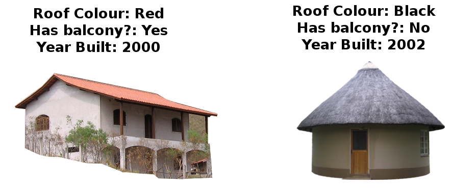
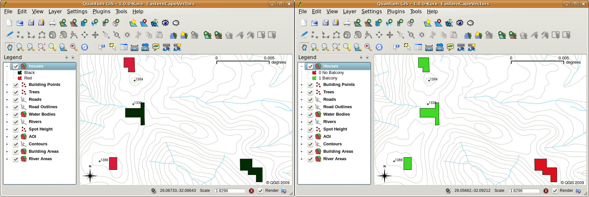
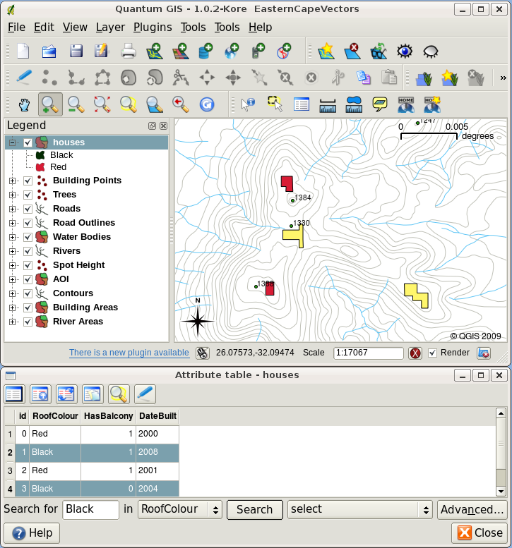

# Атрибутивна таблица

## Преглед

Ако всяка линия на картите беше изобразявана със същия цвят, пунктир и дебелина, то картите щяха да са адски скучни, трудни за четене и практически безполезни. Например вижте `figure_map_attributes`{.interpreted-text role="numref"}.

В тази глава ще видим как атрибутите на обектите могат да ни помогнат за направата на интересни карти. В предходната глава относно векторните данни накратко засегнахме, че **атрибутите** се използват, за да представят **описанието на обекти**.

Геометриите на тези сгради са полигони (застроената площ), а отбелязаните атрибути са цвят на покрива, наличието на балкон и годината на строеж. Забележете, че атрибутите не включват само видими характеристики. Те могат да опиша и неща, които знаем за обекта като годината на строеж. В ГИС програма можем да представим сградите като векторен слой с полигони houses и следните атрибути в атрибутивната таблица.

Комбинацията между атрибути и геометрия в ГИС отваря много възможности за анализ и визуализация. Например стойностите на атрибутите могат да се използват, за да се изисква от ГИС програмата да изрисува обекта по определен начин. Процесът на настройване на цвета и символа, използвани за изобразяване на обектите, се нарича настройване на **символогията** на слоя.

Атрибутите са полезни още при поставянето на **етикети** на картата. Повечето ГИС програми имат възможност за избор на атрибут, който да служи за етикет.

Ако някога сте търсили обект на карта по име, знаете колко трудно може да е това. Наличието на атрибут може да направи търсенето бързо и лесно.

Не на последно място, но атрибутите са изключително ценни при провеждането на **пространствен анализ**. При него се комбинира пространствената и атрибутивната информация на обектите. Това позволява да се изследва как обектите си взаимодействат един с друг.

> Всичко е свързано с всичко останало. Но по-близките обекти са по-свързани, отколкото по-отдалечените обекти.

Първия закон на географията, въведен от Уолдо Р. Тоблер 1969

Има много видове пространствени анализи, например може да потърсите колко керемидени покриви има в даден квартал. Това е важно, ако сте застрахователна компания, защото е определящо за риска при силна градушка. Друг пример е да се открият всички дървета на не повече от 4 метра от пътното платно, предвид предстоящия план за разширение на пътя. Или пък проби с качеството на водата по течението на дадена река и възможността да се изследва как дадено замърсяване се развива. Възможностите са безкрайни! Но ще разгледаме това по-подробно по-късно.

Преди да продължим с атрибутите в повече подробности, нека набързо си пропомним.

Обектите представят реални неща от заобикалящия ни свят - пътища, имоти, електрически стълбове, дървета, тръбопроводи и т.н. Всеки **обект** може да има **геометрия**, което определя дали е **точка**, **линия** или **полигон**, както и **атрибути**, които описват обекта.

## Още за атрибутите

Атрибутите на векторен обект се съхраняват в **таблица**. Таблицата е обикновена електронна таблица. Всяка колона в таблицата се нарича **поле**. Всеки ред е **запис**. Всеки запис в атрибутивната таблица съотвества на обект. Обикновено данните от атрибутивната таблица се съхраняват в някакъв вид база данни. ГИС програмите правят връзката между атрибутите и геометрията на обекта, така че може да откривате записи в таблицата като избирате геометрия по картата, както и да откривате геометрия по картата като избирате определен запис от таблицата.

| записи\атрибути |  поле 1: year_built (година на построяване) | поле 2: roof_material (материал на покрива) | поле 3: has_balcony (наличие на балкон) |
|-----------------|---------------------------------------------|---------------------------------------------|-----------------------------------------|
| запис 1        | 1998                | керемиди                 | да |
| запис 2        | 2000                | бетон               | не |
| запис 3        | 2001                | метал              | да |

Атрибутивната таблица съдържа атрибути (колони) и записи (редове).

Всяко поле в атрибутивната таблица съдържа конкретен тип данни -- текст, число или дата. Изборът какви атрибути да заложим за обектите изисква известно обмисляне и планиране. В нашия пример със сградите избрахме атрибутите - цвят, наличието на балкон и датата на строеж. Със същия успех можеше да изберем други свойства на сградите, като например:

- етажност;
- брой стаи;
- брой обитатели;
- тип на сградата (масивна къща, сглобяема къща, барака, блок и т. н.);
- година на строеж;
- квадратура;
- и т. н.

Как тогава при толкова много възможности да изберем кои ще са подходящите атрибути, за да опишем нашите обекти? Обикновено отговорът се крие в това какво смятаме да правим с данните. Ако искаме да направим цветна карта с възрастта на сградите, то тогава има смисъл да добавим атрибут за годината на строеж. В случай, че сме абсолютно сигурни, че такава карта никога няма да са ни от полза, то тогава няма и смисъл да имаме такъв атрибут. Събирането и съхранението на ненужна информация е лоша идея, предвид усилията вложени в събирането на информацията. Много често векторните данни имат за произход компании, администрации или колеги. В тези случаи нямаме контрол върху това с какви атрибути разполагаме.

## Едноцветна симвология

Обектите са изобразени по много обикновен начин, когато не се използват данни от атрибутивната таблица. Например за точковите обекти може да изберете цвят и маркер (кръг, квадрат, звезда и пр.) и това е. Не може да кажете на QGIS да изобрази обектите на база някое от свойствата им, записани в атрибутивната таблица. За да постигнете това, ще се нуждаете от **категоризирана**, **преливаща** или **уникална стойност** симвология. Те са описани в подробности в следващите секции.

QGIS ще позволи да се настрои симвология чрез специален **диалогов прозорец**. Може изберете цветовете и типа на символа. Показаните настройки зависят и от типа на геометрията на слоя. Например за точкови слоеве е наличен избор на **Стил на маркера**. При линии или полигони няма такава настройка, но пък има настройка за **Стил на линията** и цвят, където може да се избере например оранжева пунктирана линия за коларски пътища, непрекъсната оранжева за третокласни пътища и т.н. При слоеве с полигони може да се избере **стил на запълването**.

## Симвология с категоризирани цветове

Някои векторни обекти имат атрибути с числова стойност. Изолиниите са добър пример за това. Всяка изолиния обикновено има атрибут `height` (височина) който съдържа информация за надморската височина. По-рано в тази глава показахме изолиниите изрисувани с един и същ цвят. Добавянето на различни цветове може да помогне за по-доброто осъзнаване на смисъла на изолиниите. Например линиите от ниските части могат да са в един цвят, тези от средните части в друг, а тези от високите части - в трети.

Настройката на цветовете по групи се нарича категоризирана симвология в QGIS. Процесът е показан на `figure_graduated_symbol`{.interpreted-text role="numref"} и `figure_graduated_symbol_map`{.interpreted-text role="numref"}. **Категоризирани символи** са най-приложими, когато трябва ясно да се покаже разликата между обекитте със стойности на атрибута в различни интервали. QGIS на база стойностите на атрибута и въведения брой категории ще сметне интервалите, на които да ги раздели. Този процес е показан в [table\_graduated](#table_graduated).

  | Стойност на атрибута |   Клас      |
  |----------------------|-------------|
  | 1                    | Клас 1      |
  | 2                    | Клас 1      |
  | 3                    | Клас 1      |
  | 4                    | Клас 2      |
  | 5                    | Клас 2      |
  | 6                    | Клас 2      |
  | 7                    | Клас 3      |
  | 8                    | Клас 3      |
  | 9                    | Клас 3      |

Категоризираните цветове разделят стойността на атрибута спрямо зададения брой класове. Всеки клас се представя с различен цвят.

## Симвология с преливащи цветове

Видяхме как да изобразим обектите в отдени групи и класове със символогията **категоризирани цветове**. Понякога е полезно обектите да се изобразят в **преливащи цветове** от един цвят в друг. QGIS ще използва стойността на числов атрибут на обекта (напр. височината на изолинията или нивото на замърсяване на потока), за да определи какъв цвят да използва. В таблицата  [table\_continuous](#table_continuous) показва как стойността на атрибута се използва за определяне на преливащите цветове.

| Стойност на атрибута | Цвят (нямаме класове или групиране) |
|----------------------|---------------------------------|
|  1                   | 100% бял                        |
|  2                   | 10% сив                         |
|  3                   | 20% сив                         |
|  4                   | 30% сив                         |
|  5                   | 40% сив                         |
|  6                   | 50% сив                         |
|  7                   | 60% сив                         |
|  8                   | 70% сив                         |
|  9                   | 80% сив                         |
|  10                  | 90% сив                         |
|  11                  | 100% черен                      |

Table Continuous: Continuous colour symbology uses a start colour (e.g.
light orange shown here) and an end colour (e.g. dark brown shown here)
and creates a series of shades between those colours.

Using the same contours example we used in the previous section, let\'s
see how a map with continuous colour symbology is defined and looks. The
process starts by setting the layers properties to continuous colour
using a dialog like the one shown in
`figure_continuous_symbol`{.interpreted-text role="numref"}.

After defining the minimum and maximum colours in the colour range, the
colour features are drawn in will depend on where the attribute lies in
the range between minimum and maximum. For example if you have contour
features with values starting at 1000 m and ending at 1400 m, the value
range is 1000 to 1400. If the colour set for the minimum value is set to
orange and the colour for the maximum value is black, contours with a
value of close to 1400 m will be drawn close to black. On the other hand
contours with a value near to 1000 m will be drawn close to orange (see
`figure_continuous_symbol_map`{.interpreted-text role="numref"}).

## Симвология с уникални стойности

Освен визуализацията на числови атрибути, често трябва да комуникираме и атрибути с **текстова** стойност. Често в такива атрибути се съхранява някакъв вид качествен показател. Най-често това е името. Можем да кажем на ГИС програмата за всяка уникална стойност да покаже различна симвология. Например пътищата могат да са с различен цвят, спрямо класа им (напр. магистрала, скоростен път, първокласен път, коларски път и т. н.). Това е показано в
[table\_unique](#table_unique).

| Атрибут | Цвят и символ |
|---------|---------------|
| магистрала | червен, удебелена линия |
| първокласен път | жълт, средна линия |
| второкласен път | жълт, тънка линия |
| коларски път | кафяв, пунктирана тънка линия |

С уникалните стойности на атрибутите за група обекти (напр. пътища), всяка стойност на атрибута може да има собствен символ.

Within the GIS Application we can open/choose to use Unique Value
symbology for a layer. The GIS will scan through all the different
string values in the attribute field and build a list of unique strings
or numbers. Each unique value can then be assigned a colour and style.
This is shown in `figure_unique_symbol`{.interpreted-text
role="numref"}.

When the GIS draws the layer, it will look at the attributes of each
feature before drawing it to the screen. Based on the value in the
chosen field in the attribute table, the road line will be drawn with
suitable colour and line style (and fill style if its a polygon
feature). This is shown in `figure_unique_symbol_map`{.interpreted-text
role="numref"}.

## Препъникамъчета

Изборът на атрибути и симвология изисква известно планиране. Преди да започне събирането на каквато и да е **геопространствена** информация, трябва да сме сигурни какви атрибути ни представляват интерес и как ще ги изобразим на картата. Доброто планира е ключово, предивд че трудно можем да се върнем и да съберем данните отново. Целта на събирането на данни за обектите не е самоцел, а е необходимо, за да се извърши желания пространствен анализ и да се интерпретира пространствената информация. Какъв точно е този анализ зависи от въпросите, на които искаме да отговорим. Симвология е езикът, с който комуникираме с нашите читатели, затова е важно как атрибутите ще се реализират във визуални елементи. Не бива да подценявате времето и усилията необходими за определяне на символогията на вашата карта.

## Какво научихме?

Да обобщим:

 - Обектите във векторните слоеве имат **атрибути**.
 - Атрибутите **представят** някои от **свойствата** на обектите.
 - Атрибути се съхраняват в **таблица**.
 - Редовете в таблицата се наричат **записи**.
 - Във векторния слой имаме по **един запис за всеки обект**.
 - Колоните на таблицата се наричат **полета**.
 - Полетата представят **свойствата** на обектите, напр. височина, материал на покрива, възраст и др.
 - Полетата могат да съдържат информация под формата на **числа**, **текст** (още известни като низове или стрингове), **дати** и **двоична (булева) стойност**.
 - Атрибутите на даден обект могат да определят какъв **символ** да го изобрази
 - **Категоризираната** симвология групира данните, като разделя всички стойности на избран числов атрибут на избран брой класове.
 - **Преливащата** симвология показва непрекъснато свойство на обектите, изобразено чрез преливането от един цвят към друг.
 - **Уникалната** симвология налага различен цвят за всяка една уникална стойност, налична за дадения атрибут.
 - **едноцветна симвология** описва ситуацията, когато атрибутите не са използвани за определяне на цвета и символа, с който обектът е представен.

## Практика!

Ето някои идеи за упражнения:

- Намислете си различни видове слоеве и помислете за подходяща симвология.
    - Ето примери:

| Обекти | Геометрия | Симвология |
|--------|-----------|------------|
| училища | точка | **Уникална симвология** за всяко училище в района. |
| училища | полигони | **Уникална симвология** за всяко училище в района. |
| улична мрежа | линия | Нека учениците споделят по коя улица поемат, за да се приберат до вкъщи. **Категоризирана симвология** за броят ученици, споделящи един и същи път до дома. |
| улична мрежа | линия | Нека учениците оценят състоянието на улиците около вашето училище, като ги разделят на участъци между две кръстовища и оценят всеки участък от 1 до 10. Използвайте **преливаща симвология**, за да покажете състоянието на уличната мрежа. |
| ученици по класове | полигон | Избройте колко ученици има във всяка класна стая и използвайте цветовете от червено до синьо, за да ги изобразите с **преливащ цвят**. |

- Опитайте се да определите каква симвология е удачно да се използва в следните случаи:
    - точки показващи киселинността (pH) на почвени проби в района на училището;
    - линии показващи уличната мрежа в селището;
    - полигони със сгради и атрибут за материала (тухла, кирпич, бетон и пр.).

Примерна таблица с типа обекти и съответния вид симвология.

## Друга възможност

Ако нямате компютър под ръка, може да използвате палус и карта 1:50000, за да експериментирате с различни видове симвология. Например поставете палуса върху картата и с червен флумастер изобразете всички изолинии под 900 м. н. в. и със зелено всички равни или над 900 м. н. в. Може ли да се опитате да възпроизведете други типове симвология по същия начин?

## Допълнителни материали

**Страница:** <https://en.wikipedia.org/wiki/Cartography>

QGIS ръководството има подобна информация как се работи с атрибутивната таблица и символогията в QGIS.

## Какво следва?

В следващата глава ще разгледаме **създаването на данни**, където на практика ще използваме знанията ни за векторните данни и техните атрибути.