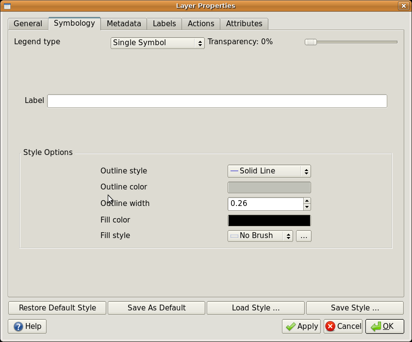
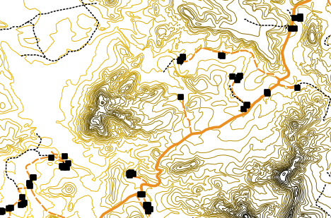
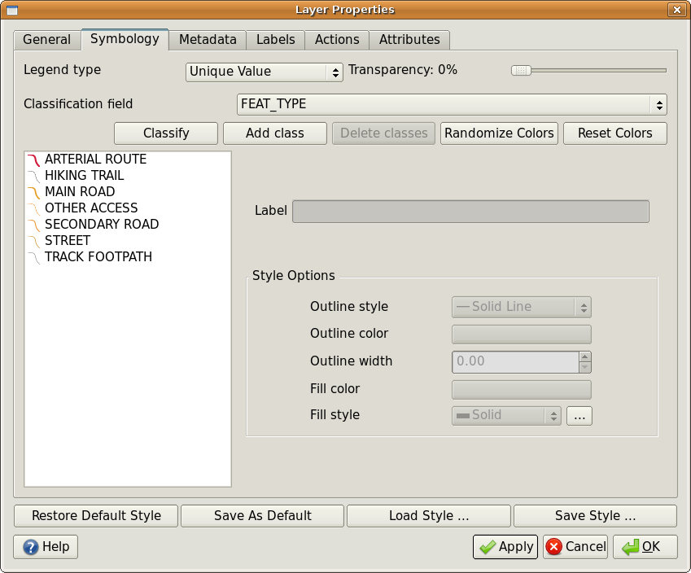
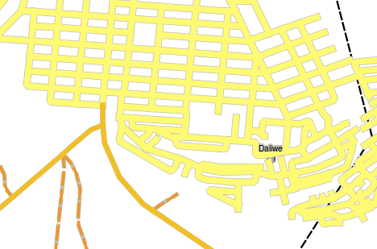

# Атрибутивна таблица

## Преглед

В тази глава ще видим как атрибутите на обектите могат да ни помогнат за направата на по-лесноразбираеми карти. В предходната глава относно векторните данни накратко засегнахме, че **описанието** на обектите се случва посредством **атрибути**.

Атрибутите са допълнителната информация за всеки един обект, която не влиза в основното му геометрично представяне. Например при векторен слой със сградите в едно селище освен самите полигони, които описват сградите, важно е да знаем и редица атрибути (характеристики) като година на построяване, етажност, предназначение, собственост, вид строителство и др. Тези атрибути могат да бъдат както видими физически свойства (етажност, вид строителство), така и абстрактни понятия (година на построяване, предназначение, собственост). Тези атрибути могат да бъдат представени в електронна таблица, където всеки ред представя отделен обект, а всяка колона - отделен атрибут. Това по никакъв начин не се различава от нормална електронна таблица в LibreOffice Calc или Microsoft Office Excel, освен че имаме още една "скрита" колона, която съответства на геометрията на обекта.

### Визуализация 
Разчитането на съдържанието на картите щеше да е крайно трудно, ако не си служехме с различни цветове, символи и дебелини на линиите по картите.

Комбинацията между атрибути и геометрия в ГИС отваря безкрайни възможности за анализ и визуализация. Например стойностите на атрибутите могат да се използват, за да се изисква от ГИС програмата да изрисува обекта по определен начин. Процесът на настройване на цвета и символа, използвани за изобразяване на обектите, се нарича настройване на **символогията** на слоя.

### Етикети

Атрибутите са полезни още при поставянето на **етикети** на картата. Етикети са надписите, които се изписват за всеки един обект, за да се опишем какво изобразяваме на картата. Най-често това е името на обекта, но може да бъде също и някакъв показател или комбинация от двете. Например на карта на общините в България ще срещнем етикети като София, Русе, Карлово, Чупрене и др. Ако правим карта на населението на страната по общини, то за всяка община може да изпишем броя на населението в хиляди души, но с предположението, че консуматорите на картата знаят разположението и имената на общините. За да си спестим такова предположение, може да поставим етикети, които съдържат едновременно името на общината и броят на населението.

TODO пример с етикети на имена общини, население на общини, имена на общини и население

### Търсене по атрибути

Ако някога сте търсили обект на карта по име, знаете колко трудно може да е това. Наличието на атрибут може да направи търсенето бързо и лесно.

### Пространствен анализ

Не на последно място, но атрибутите са изключително ценни при провеждането на **пространствен анализ**. При него се комбинира пространствената и атрибутивната информация на обектите. Това позволява да се изследва как обектите си взаимодействат един с друг.

> Всичко е свързано с всичко останало. Но по-близките обекти са по-свързани, отколкото по-отдалечените обекти.

Първият закон на географията, въведен от Уолдо Р. Тоблер 1969

Има много видове пространствени анализи, например може да потърсите колко керемидени покриви има в даден квартал. Това е важно, ако сте застрахователна компания, защото е определящо за риска при силна градушка. Друг пример е да се открият всички дървета на не повече от 4 метра от пътното платно, предвид предстоящия план за разширение на пътя. Или пък проби с качеството на водата по течението на дадена река и възможността да се изследва как дадено замърсяване се развива. Възможностите са безкрайни! Но ще разгледаме това по-подробно по-късно.

Преди да продължим с атрибутите в повече подробности, нека набързо си пропомним.

Обектите представят реални неща от заобикалящия ни свят - пътища, имоти, електрически стълбове, дървета, тръбопроводи и т.н. Всеки **обект** може да има **геометрия**, което определя дали е **точка**, **линия** или **полигон**, както и **атрибути**, които описват обекта.

```mermaid
graph TD
  Обект --> Геометрия
  Геометрия --> Точка
  Геометрия --> Линия
  Геометрия --> Полигон
  Обект --> Атрибути
```

## Още за атрибутите

Атрибутите на векторен обект се съхраняват в **таблица**. Таблицата е обикновена електронна таблица. Всяка колона в таблицата се нарича **поле**. Всеки ред е **запис**. Всеки запис в атрибутивната таблица съотвества на обект. Обикновено данните от атрибутивната таблица се съхраняват в някакъв вид база данни. ГИС програмите правят връзката между атрибутите и геометрията на обекта, така че може да откривате записи в таблицата като избирате геометрия по картата, както и да откривате геометрия по картата като избирате определен запис от таблицата.

| записи\атрибути | поле 1: year_built (година на построяване) | поле 2: roof_material (материал на покрива) | поле 3: has_balcony (наличие на балкон) |
|-----------------|--------------------------------------------|---------------------------------------------|-----------------------------------------|
| запис 1         | 1998                                       | керемиди                                    | да                                      |
| запис 2         | 2000                                       | бетон                                       | не                                      |
| запис 3         | 2001                                       | метал                                       | да                                      |

Атрибутивната таблица съдържа атрибути (колони) и записи (редове).

Всяко поле в атрибутивната таблица съдържа конкретен тип данни -- текст, число или дата. Изборът какви атрибути да заложим за обектите изисква известно обмисляне и планиране. В нашия пример със сградите избрахме атрибутите - цвят, наличието на балкон и датата на строеж. Със същия успех можеше да изберем други свойства на сградите, като например:

- етажност;
- брой стаи;
- брой обитатели;
- тип на сградата (масивна къща, сглобяема къща, барака, блок и т. н.);
- година на строеж;
- квадратура;
- и т. н.

Как тогава при толкова много възможности да изберем кои ще са подходящите атрибути, за да опишем нашите обекти? Обикновено отговорът се крие в това какво смятаме да правим с данните. Ако искаме да направим цветна карта с възрастта на сградите, то тогава има смисъл да добавим атрибут за годината на строеж. В случай, че сме абсолютно сигурни, че такава карта никога няма да са ни от полза, то тогава няма и смисъл да имаме такъв атрибут. Събирането и съхранението на ненужна информация е лоша идея, предвид усилията вложени в събирането на информацията. Много често векторните данни имат за произход компании, администрации или колеги. В тези случаи нямаме контрол върху това с какви атрибути разполагаме.

## Едноцветна симвология

Обектите са изобразени по много опростен начин, когато не се използват данни от атрибутивната таблица. Например за точковите обекти може да изберете цвят и маркер (кръг, квадрат, звезда и пр.) и това е. Не може да кажете на ГИС програмата да изобрази обектите на база някое от свойствата им, записани в атрибутивната таблица. Това е начинът, по който се зареждат слоевете първоначално при зареждането им в ГИС.

ГИС прогамата позволява да се настрои симвология чрез специален екран - **диалогов прозорец** или **панел**. Можем да изберем цветовете и типа на символа. Показаните настройки зависят и от типа на геометрията на слоя. Например за точкови слоеве е наличен избор на **стил на маркера**. При линии или полигони няма такава настройка, но пък има настройка за **стил на линията** и цвят, където може да се избере например оранжева пунктирана линия за коларски пътища, непрекъсната оранжева за третокласни пътища и т.н. При слоеве с полигони може да се избере **стил на запълването**.

За да постигнете това, ще се нуждаете от **категоризиран цвят**, **преливащ цвят** или **уникален цвят** симвология. Те са описани в подробности в следващите секции на тази глава.

## Симвология с категоризирани цветове

Някои векторни обекти имат атрибути с числова стойност. Изолиниите са добър пример за това. Всяка изолиния обикновено има атрибут `height` (височина) който съдържа информация за надморската височина. По-рано в тази глава показахме изолиниите изрисувани с един и същ цвят. Добавянето на различни цветове може да помогне за по-доброто комуникиране на смисъла на изолиниите. Например линиите от ниските части могат да са в един цвят, тези от средните части в друг, а тези от високите части - в трети.

Настройката на цветовете по групи се нарича **категоризирана симвология**. Категоризираните символи са най-приложими, когато трябва ясно да се покаже разликата между обекитте със стойности на атрибута в различни интервали. QGIS на база стойностите на атрибута и въведения брой категории ще сметне интервалите, на които да ги раздели.

  | Стойност на атрибута | Клас   |
  |----------------------|--------|
  | 1                    | Клас 1 |
  | 2                    | Клас 1 |
  | 3                    | Клас 1 |
  | 4                    | Клас 2 |
  | 5                    | Клас 2 |
  | 6                    | Клас 2 |
  | 7                    | Клас 3 |
  | 8                    | Клас 3 |
  | 9                    | Клас 3 |

Категоризираните цветове разделят стойността на атрибута спрямо зададения брой класове. Всеки клас се представя с различен цвят.

## Симвология с преливащи цветове

Видяхме как да изобразим обектите в отделни групи и класове със символогията **категоризирани цветове**. Понякога обаче е полезно обектите да се изобразят в един или няколко **преливащи цветове** от един в друг. ГИС програмата ще използва стойността на числов атрибут на обекта (напр. височината на изолинията или нивото на замърсяване на потока), за да определи какъв цвят да използва. 

| Стойност на атрибута | Цвят (нямаме класове или групиране) |
|----------------------|-------------------------------------|
| 1                    | 100% бял                            |
| 2                    | 10% сив                             |
| 3                    | 20% сив                             |
| 4                    | 30% сив                             |
| 5                    | 40% сив                             |
| 6                    | 50% сив                             |
| 7                    | 60% сив                             |
| 8                    | 70% сив                             |
| 9                    | 80% сив                             |
| 10                   | 90% сив                             |
| 11                   | 100% черен                          |

Таблица преливащи цветове: Преливащите цветове започват с начален цвят (напр. бяло) и краен цвят (напр. черно) и създават редица оттенъци на цвета между тях.

Ако използваме същия пример с хоризонталите от предната секция, нека видим как би изглеждала с преливащи цветове. Процесът стартира с избирането на "преливащи цветове" ГИС програмата.

След като определим начален и краен цвят, изборът на цвят при изчертаването на обектите ще зависи от местоположението на стойността на числовия атрибут между най-ниската и най-високата стойност. Например ако имаме хоризонтали с атрибути за надморската височина между 1000 и 1400 м., най-ниската стойност на числовия атрибут е 1000 и най-високата 1400. В този случай ако изберем за минимална стойност да използваме оранжево, а за максимална черно, то хоризонталите отговарящи на по-малка надморска височина ще бъдат ярко оранжеви, постепенно преливащи в кафяво, докато за най-високите части са много тъмни до черни.

## Симвология с уникални стойности

Освен визуализацията на числови атрибути, често трябва да комуникираме и атрибути с **текстова** стойност. Често в такива атрибути се съхранява някакъв вид качествен показател. Най-често това е името. Можем да кажем на ГИС програмата за всяка уникална стойност да покаже различна симвология. Например пътищата могат да са с различен цвят, спрямо класа им (напр. магистрала, скоростен път, първокласен път, коларски път и т. н.). Това е показано в
[table\_unique](#table_unique).

| Атрибут         | Цвят и символ                 |
|-----------------|-------------------------------|
| магистрала      | червен, удебелена линия       |
| първокласен път | жълт, средна линия            |
| второкласен път | жълт, тънка линия             |
| коларски път    | кафяв, пунктирана тънка линия |

С уникалните стойности на атрибутите за група обекти (напр. пътища), всяка стойност на атрибута може да има собствен символ. ГИС програмата ще обходи всички налични обекти и стойности за избрания атрибут и ще създаде по един символ за всяка уникална стойност. Всеки уникален символ може да бъде впоследствие променен за да отговаря напълно на изискванията за визуализация.

Преди да бъде изчертан всеки един обект, ГИС програмата прочита атрибутите му и и решава по какъв начин да го изобрази. Това решение зависи от настройката кой атрибут сме избрали за символогията с уникални стойности. Например при слой с пътища всеки вид пътища (магистрали, първокласни, черни пътища) записани в атрибута `type` и симвология с уникални стойности по същия атрибут ще доведе до изчертаването на линиите по различен начин за всеки тип (напр. оранжево за магистрали, жълто за първокласни, зелено за черни пътища).

## Препъникамъчета

Изборът на атрибути и симвология изисква известно планиране. Преди да започне събирането на каквато и да е **геопространствена** информация, трябва да сме сигурни какви атрибути ни представляват интерес и как ще ги изобразим на картата. Доброто планира е ключово, предивд че трудно можем да се върнем и да съберем данните отново. Целта на събирането на данни за обектите не е самоцел, а е необходимо, за да се извърши желания пространствен анализ и да се интерпретира пространствената информация. Какъв точно е този анализ зависи от въпросите, на които искаме да отговорим. Симвология е езикът, с който комуникираме с нашите читатели, затова е важно как атрибутите ще се реализират във визуални елементи. Не бива да подценявате времето и усилията необходими за определяне на символогията на вашата карта.

## Какво научихме?

 - Обектите във векторните слоеве имат **атрибути**.
 - Атрибутите **представят** някои от **свойствата** на обектите.
 - Атрибути се съхраняват в **таблица**.
 - Редовете в таблицата се наричат **записи**.
 - Във векторния слой имаме по **един запис за всеки обект**.
 - Колоните на таблицата се наричат **полета**.
 - Полетата представят **свойствата** на обектите, напр. височина, материал на покрива, възраст и др.
 - Полетата могат да съдържат информация под формата на **числа**, **текст** (още известни като низове или стрингове), **дати** и **двоична (булева) стойност**.
 - Атрибутите на даден обект могат да определят какъв **символ** да го изобрази
 - **Категоризираната** симвология групира данните, като разделя всички стойности на избран числов атрибут на избран брой класове.
 - **Преливащата** симвология показва непрекъснато свойство на обектите, изобразено чрез преливането от един цвят към друг.
 - **Уникалната** симвология налага различен цвят за всяка една уникална стойност, налична за дадения атрибут.
 - **едноцветна симвология** описва ситуацията, когато атрибутите не са използвани за определяне на цвета и символа, с който обектът е представен.

## Практика!

Ето някои идеи за упражнения:

- Намислете си различни видове слоеве и помислете за подходяща симвология.
    - Ето примери:

| Обекти             | Геометрия | Симвология                                                                                                                                                                                                                                  |
|--------------------|-----------|---------------------------------------------------------------------------------------------------------------------------------------------------------------------------------------------------------------------------------------------|
| училища            | точка     | **Уникална симвология** за всяко училище в района.                                                                                                                                                                                          |
| училища            | полигони  | **Уникална симвология** за всяко училище в района.                                                                                                                                                                                          |
| улична мрежа       | линия     | Нека учениците споделят по коя улица поемат, за да се приберат до вкъщи. **Категоризирана симвология** за броят ученици, споделящи един и същи път до дома.                                                                                 |
| улична мрежа       | линия     | Нека учениците оценят състоянието на улиците около вашето училище, като ги разделят на участъци между две кръстовища и оценят всеки участък от 1 до 10. Използвайте **преливаща симвология**, за да покажете състоянието на уличната мрежа. |
| ученици по класове | полигон   | Избройте колко ученици има във всяка класна стая и използвайте цветовете от червено до синьо, за да ги изобразите с **преливащ цвят**.                                                                                                      |

- Опитайте се да определите каква симвология е удачно да се използва в следните случаи:
    - точки показващи киселинността (pH) на почвени проби в района на училището;
    - линии показващи уличната мрежа в селището;
    - полигони със сгради и атрибут за материала (тухла, кирпич, бетон и пр.).

Примерна таблица с типа обекти и съответния вид симвология.
