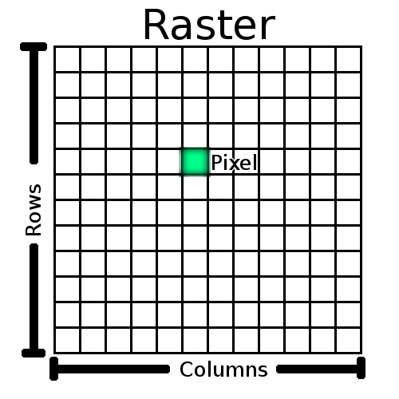
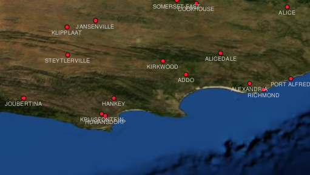
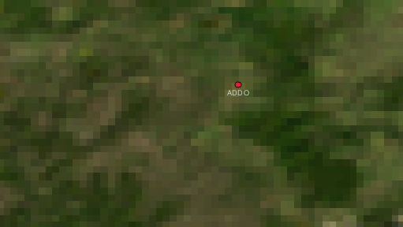

# Растери

## Преглед

В предишните глави разгледахме векторните данни в подробности и научихме, че при тях имаме отделни обекти. Всеки обект се представя в пространството с геометрия, било то точка, линия или полигон. Сега е време да обърнем внимание на другия основен вид данни в ГИС, а именно **растерните**. Те са представляват мрежа от плътно слепени **клетки** с еднаква форма и и размер. Тези клетки наричаме **пиксели**, като най-често това са квадратни пиксели разположени в **редове** и **колони**. Всеки пиксел съхранява една или повече числови стойности, които са валидни за цялата площ на пиксела. В тази глава ще се задълбочим в приложението и полезността на растерните данни.

Всъщност всяка най-обикновена снимка, било то селфи в огледалото, или спътникова снимка, представлява растерно изображение. То има определена резолюция, което определя броят редове и колони,а всеки пиксел съхранява число, описващо цвета.

В контекста на ГИС, всеки пиксел покрива определена площ от земната повърхност, като неговата стойност се приема за хомогенна за цялата му площ.

## Още за растерните данни

В ГИС използваме растери, когато представяме информация за непрекъснат обект или явление за дадена територия. Когато си обяснявахме за векторните данни, разгледахме пейзаж погледнат от високо. Точки, линии и полигони добре описваха индивидуалните обекти, но как да опишем нещо като цвета на тревата например? Или надморската височина? Или пък температурата на въздуха? За разлика от конкретното дърво, или конкретната къща, измерване на надморската височина може да се случи във всяка една безкрайно малка точка.

Възможно решение е да оградим големи участъци в полигони, за които да зададем средната надморска височина. Проблемът е, че дори и в този случай на цялата площ не наблюдаваме еднаква стойност. Това е защото векторните данни са по-удачни за показване на хомогенни обекти по качествен признак. Например полигона и атрибутите, с които се описва територията на някоя община, не се променят за целия обхват на общината, тя си има все същия кмет, все същите граници и все същия общински център.

Добре, другия вариант за събиране на данни за надморската височина е просто да направим полигоните по-малки, за да гарантираме, че нямаме отклонение с повече от 1 метър за тази площ. Това е правдоподобно решение, но изведнъж ще се окаже, че работим със стотици (хиляди) обекти и това ще затормози както нас, така и ГИС програмата.

Растерните данни са решението в точно такива случаи. Много често растери се използват като фон на векторни слоеве, за да се опише по-добре контекста на весторните слоеве. Хората са добре приспособени да извличат информация от изображения, именно затова картите с подходяща непрекъсната картна основа успяват да предадат повече информация.

Макар и най-често асоциирани със спътникови изображения на земната повърхност, растерните данни са приложими и съхранението на по-абстрактни идеи. Примери за това са надморската височина, сума на валежите, сеизмичен риск, гъстота на населението и т.н. Ето например спътниково изображение и извлечена преработена изображение от него.

## Геореференциране

**Геореференцирането** е процесът на задаване на точния териториален обхват на изображението. Тази информация се съхранява като **метаданни**, за да може ГИС програмата да покаже изображението на правилното място на картата. Информацията необходима за правилното геореференциране в най-простия случай се състои от координатите на горния ляв ъгъл на изображението, широчина и височина на всеки пиксел, която съответства върху земната повърхност, както и с колко е завъртяно изображението. Обикновено тази информация е достатъчна, за да може всяка ГИС програма да покаже снимката привилно. Тя се съхранява най-често вътре в самия растерен файл, но понякога е и като отделен текстови файл придружаващ изображението.

## Източници на растери

Растери могат да се извлекат по различни начини. Двата най-разпространени са въздушното и спътниковото заснемане. При въздушното заснемане летателен апарат, било то самолет, хеликоптер или дрон, облита дадена територия и я заснема със специално пригодена камера, или по-общо **сензор**. Спътниковите изображения пък се заснемат от много по-голяма височина всеки път когато преминат над територия, която представлява интерес. И в двата случая тези данни и придружаващите ги метаданни се нуждаят от последваща обработка на Земята, която да направи изображенията използваме и георефенцирани. Целия този процес се нарича **дистанционни изследвания**.

В други случаи, растерите се изчисляват. Например метеоролозите биха растерен слой на средната температура, валежи, скорост или посока на вятъра за цялата територия на страната, въпреки че тези замервания са се случили само в проделени точки, където има метеорологични станции. За целта са приложили специален метод за пространствен анализ наречен интерполация, който ще разгредаме по-подробно в една от следващите глави.

Често растери са генерирани и от векторни слоеве, просто защото работата с растери е много по-лесна. Например Гугъл карти или OpenStreetMap, които показват множество векторни обекти като пътища, реки, сгради, гари, паркове, ресторанти и прочие, всъщност се визуализират за крайните потребители като растери. Това е приложимо само ако данните могат да бъдат комуникирани само със симвология и етикети. Ако се налага да работим изключително с атрибутивната таблица, то тогава растеризираните вектори не са най-добрия вариант.

??? note "Забележка"
    OpenStreetMap и подобни услуги всъщност прилагат трик, с който да покажат данните от атрибутивната таблица. Всеки път когато потребителят натисне върху точка от картата, нейните координати се изпращат до сървъра и той връща атрибутите на векторния обект, който се намира точно на това място.

## Разделителна способност

### Пространствена разделителна способност (ПСР)

Всеки растер се състои от пиксели с еднакви размери. Именно тези размери определят разделителната способност, или на каква площ от земната повърхност отговаря един пиксел. Това ясно се забелязва, ако приближим достатъчно в някой растерен слой.

Several factors determine the spatial resolution of an image. For remote
sensing data, spatial resolution is usually determined by the
capabilities of the sensor used to take an image. For example SPOT5
satellites can take images where each pixel is 10 m x 10 m. Other
satellites, for example MODIS take images only at 500 m x 500 m per
pixel. 

In aerial photography, pixel sizes of 50 cm x 50 cm are not
uncommon. Images with a pixel size covering a small area are called
\'**high resolution**\' images because it is possible to make out a high
degree of detail in the image. Images with a pixel size covering a large
area are called \'**low resolution**\' images because the amount of
detail the images show is low.

In raster data that is computed by spatial analysis (such as the
rainfall map we mentioned earlier), the spatial density of information
used to create the raster will usually determine the spatial resolution.
For example if you want to create a high resolution average rainfall
map, you would ideally need many weather stations in close proximity to
each other.

One of the main things to be aware of with rasters captured at a high
spatial resolution is storage requirements. Think of a raster that is 3
x 3 pixels, each of which contains a number representing average
rainfall. To store all the information contained in the raster, you will
need to store 9 numbers in the computer\'s memory. Now imagine you want
to have a raster layer for the whole of South Africa with pixels of 1 km
x 1 km. South Africa is around 1,219,090 km ^2^. Which means your
computer would need to store over a million numbers on its hard disk in
order to hold all of the information. Making the pixel size smaller
would greatly increase the amount of storage needed.

Sometimes using a low spatial resolution is useful when you want to work
with a large area and are not interested in looking at any one area in a
lot of detail. The cloud maps you see on the weather report, are an
example of this --\-- it\'s useful to see the clouds across the whole
country. Zooming in to one particular cloud in high resolution will not
tell you very much about the upcoming weather!

От друга страна използването на растери с ниска резолюция е проблем, ако искаме да опишем обекти с малка площ. В някои случаи е възможно няколко обекта да попаднат в един и същи пиксел.

### Спектрална разделителна способност

Когато правим дигитална снимка с телефона си например, камерата използва електрически **сензор**, с който улавя яркостта на червената, зелената и синята светлина и записва тези три стойности за всеки пиксел. Когато екранът показва всеки отделен пиксел, той чете тази информация и настройва екрана да възпроизведе същия цвят светлина. Тъй като нашия сензор е уловил трите цвята червено, зелено и синьо и е записал три стойности, то създадения растер има три **канала**.

И докато нашите очи могат да виждат само тези три цвята, то електрическите сензори не са ограничени от тези недостатъци на човешкото зрение. Тъй като повечето снимки на потребители са от рода на снимка на вечерята в Инстаграм и са със съмнителен принос за научните среди, тези изображения са сам в тези три цвята. Вече дори някои съвременни мобилни телефони улавят и записват информация за инфрачервената светлина , която е **невидима** за нас.

!!! "Експеримент"
    Вземете дистанционно на някой електроуред у дома и го насочете към камерата на вашия телефон. Натиснете някое от копчетата на дистанционното. Виждате ли светлина? В случая сензора улавя светлина, която не е видима за нас и я интерпретира като червено.

Професионалните сензори за дистанционни изследвания могат записват информация и за други невидими цветове за нас. Те се наричат **многоканални** при запис на няколко и **хиперканални** при запис на интензитета на десетки или стотици дължини на вълната. Но защо? Ами например инфрачервената светлина е много добър индикатор за откриване на водни повърхности и вода в растителността. Броят на каналите в едно изображение се нарича **спекрална разделителна способност**.

Най-често изображенията в ГИС са многоканални, където всеки канал е като отделен растерен слой. ГИС позволява да се комбинират до три от тези канали, за да се покаже изображението в цветове, които човешкото око може да види. Ако избраните канали не съвпадат с реалните цветове за червено, зелено и синьо, това изображение се нарича изображение с **фалшиви цветове**.

Понякога изображението съдържа само един канал и то се нарича **сиво**. В такива случаи е въможно допълнително да се приложат цветове спрямо стойностите в пикселите и се наричат **псевдоцветове**. Особен случай на едноканалните изображения са **двоичните маски**. При тях имаме черен фон, който съответства на стойност 0, и бели обекти със стойност 1. Те се използват за маркиране на границите на отделни обекти.

TODO example grayscale vs pseudocolor

TODO example binary mask

## Преобразуване от растер към вектор

По-рано коментирахме, че често при работа с векторни слоеве изолзваме растерен слой за заден фон. Това улеснява осъзнаването на пространствения контекст на данните, както и цифроването на нови векторни обекти.

Не е задължително цифроването да става ръчно обаче. Някои особености на земната повърхност, например пътища сред ниви, представляват рязка промяна в цвета между между съседни пиксели. Тази рязка промяна позволява лесното им идентифициране от специализирани компютърни програми, които могат да извлекат данни при алгоритмичното анализиране на изображението. В днешно време автоматичното извличане на данни от изображения може да вземе предвид не само цветовете, но и формата, разположението и шарките, които те образуват. За целта се прилагат различни алгоритми, като в последните години изкуствения интелект е заел особено място в изпълнението на подобни задачи.

## Преобразуване от вектор към растер

Преобразуването от вектор към растер се нарича **растеризиране** и се прилага за улеснена обработка на пространствената информация или за разпространение на географската информация към потребители без специализиран ГИС софтуер. Особеност при растеризирането е, че информацията от атрибутивната таблица се изгубва завинаги и не може да бъде възстановена. Въпреки това числовите и категоризиращите атрибути могат да бъдат записани като отделни канали в изображението.

## Анализ на растери

Фактът, че растерите са просто поредица от еднакви по размер пиксели по редове и колони ги прави идеален кандидат за авторатизиран анализ с компютърни алгоритми, при това много по-удобен отколкото векторните данни. 

Растери често се използват и в управлението на земеделските и горските ресурси. От спътниково изображение може да се види в къде растенията са със забавено развитие, изпитват воден недостиг, са нападнати от вредител, или да изчисли обема на дървения материал. По този начин собственика на земята може да вземе информирано решение какви действия да предприеме и какво да очаква в бъдеще.

В условията на променящ се климат, анализирането на растери е незаменим инструмент за предпазване и справяне с все по-засилващите се като честата и сила природните бедствия. Например в хидрологията само с цифров модел на релефа можем да открием повърхностите потоци и съответните им водосбори, както и кои участъци имат затруднено отичане и биха се наводнили при определено количество валеж.

## Препъникамъчета

Тъй като растерите покриват големи участъци от земната повърхност, често те са с прекалено големи размери. Това води до няколко нежелани ефекта, като голямо необходимост от голямо пространство за съхранение, покриване на участъци, които не представляват интерес, както и до излишна нужда от изчислителна мощ. Размерът на растерните файлове е правопропорционален на броят канали, размерът на пикселите и обхватът на изображението.

## Какво научихме?

Let\'s wrap up what we covered in this worksheet:

-   Raster data are a grid of regularly sized **pixels.**
-   Raster data are good for showing **continually varying
    information.**
-   The size of pixels in a raster determines its **spatial
    resolution.**
-   Raster images can contain one or more **bands**, each covering the
    same spatial area, but containing different information.
-   When raster data contains bands from different parts of the
    electromagnetic spectrum, they are called **multi-spectral images**.
-   Three of the bands of a multi-spectral image can be shown in the
    colours Red, Green and Blue so that we can see them.
-   Images with a single band are called grayscale images.
-   Single band, grayscale images can be shown in pseudocolour by the
    GIS.
-   Raster images can consume a large amount of storage space.

Now you try!
============

Here are some ideas for you to try with your learners:

-   Discuss with your learners in which situations you would use raster
    data and in which you would use vector data.
-   Get your learners to create a raster map of your school by using A4
    transparency sheets with grid lines drawn on them. Overlay the
    transparencies onto a toposheet or aerial photograph of your school.
    Now let each learner or group of learners colour in cells that
    represent a certain type of feature e.g. building, playground,
    sports field, trees, footpaths etc. When they are all finished,
    overlay all the sheets together and see if it makes a good raster
    map representation of your school. Which types of features worked
    well when represented as rasters? How did your choice in cell size
    affect your ability to represent different feature types?
