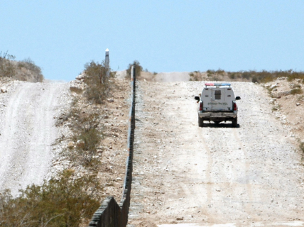
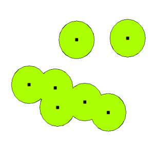
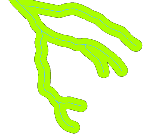
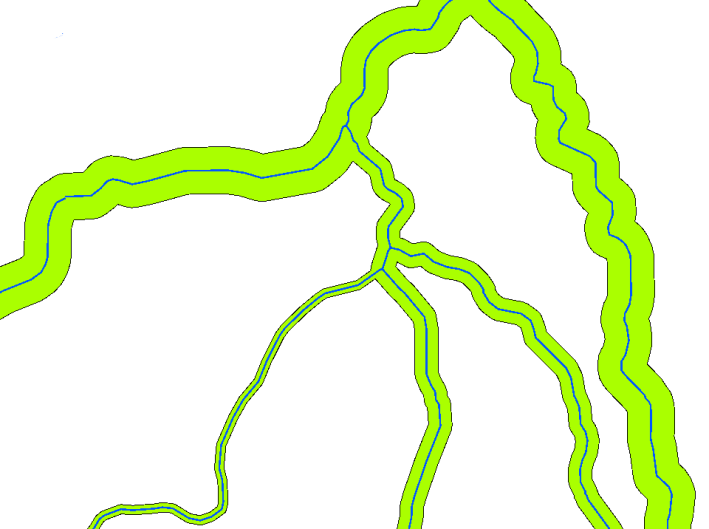
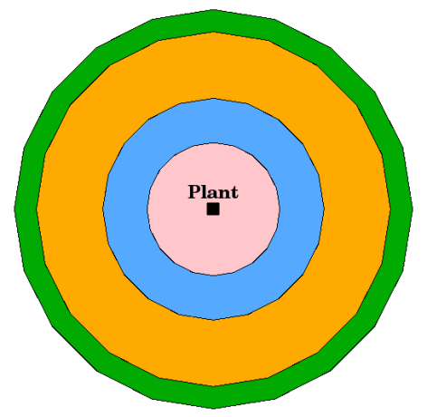

# Анализ с буфери

## Преглед

**Пространствения анализ** използва пространствени данни, за да извлече нова допълнителна информация. За целта ГИС програмите разполагат с набор от инструменти, които посредством различни алгоритми могат да изведат статистически или геообработени резултати. Статистически анализ са "Колко точки има в тази линия?", "Коя община е с най-голяма средна гъстота?", "Кой е най-високия връх?" и др. Геообработени резултати могат да отговорят на въпроси като "Колко дървета има по протежението на този път?", "През колко общини протича реката?", "Колко е стръмен този склон?" и др. 

В тази глава ще разгледаме буферирането като един от най-простите, но мощни начини за геообработка на векторни данни.

## Буфериране

**Буферирането** разделя площта около даден обект на две: една, която е на не по-далеч от зададено разстояние, и останалата, която попада отвъд този обхват. Площта, която попада в обхвата се нарича **буферна зона**.

**Буферна зона** е всяка площ, която служи за поддържане на разстояние между два обекта от реалния свят. Най-често буферни зони се създават за опазване на защитени територии, регулации в градската среда, планове за евакуация и др. Буферни зони може да се видят във вододайните зони, по границите на държавите, зоните с различни нива на шумово замърсяване около летища и др.

В ГИС програмите, **буферните зони** се представят като **векторни полигони**, които обгръщат точка, линия или полигон.

## Видове буфериране

Широчината на буферната зона за всеки един обект от даден слой може да е различна и да се контролира от някой негов числов атрибут. Този числов атрибут изразява широчината на буферната зона в картни единици за съответната координатна система на слоя, най-често метри. Така например широчината на буферната зона около бреговете на дадена река може да зависи от формата на земеделие, което се практикува, с цел намаляване на химичното замърсяване на реката с пестициди и торове.

| Река          | Форма на земеделие                | Буферна зона (метри) |
|---------------|-----------------------------------|----------------------|
| Искър         | механизирано зърнопроизводство    | 100                  |
| Марица        | интензивно отглеждане на царевица | 150                  |
| Янтра         | органично зеленчукопроизводство   | 50                   |

Таблица 1: Препоръчана буферна зона около реките спрямо формата на земеделие около тях изразени с число в метри в атрибутивната таблица.

Буферните зони около линейни обекти като реки и пътища, могат да се буферират само от лявата или дясната страна. В този случай ляво и дясно се определя спрямо посоката на линията, иначе казано края, в която се намира първата точка от линията.

### Множество буферни зони

Даден обект може да има повече от една буферна зона. Например в случай на авария в ядрена централа, вероятно е да имаме няколко буферни зони на 10, 15, 25 и 30 км със собствен план за евакуация. По този начин се оформят концентрични полигони (окръжности) около централата.

### Буфериране без и със сливане

Ако извлечената буферната зона е повече от половината от разстоянието между два обекта, очаквано двете буферни зони ще се допрат. ГИС програмите предлагат две решения на проблема - или единия полигон припокрива другия, като и двата буфера си съществуват самостоятелно, или буферната зона се слива в един общ полигон. Изборът на единия или други подход изцяло зависи от целите на анализа. 

Например, ако очертаем 1 км буферна зона около две защитени територии на 1.5 км отстояние една от друга, то трябва да преценим от какво се нуждаем.  Ако искаме да покажем индивидуалните буферни зани за всеки обект, трябва да приложим буфериране без сливане. Ако по принцип се интересуваме за обхвата на буферните зони около защитените територии, буферирането трябва да се случи със сливане.

### Буфериране навътре и навън

Буферните зони около полигони обикновено са във външна посока, но е възможно да се създаде буферна зона и навътре, към центъра на геометрията. Например, според закона строителство на 3 метра от границата от имота изисква съгласието на съседите. За целта може да буферираме полигона на парцела навътре с 3 метра и по този начин да проверим дали ще се нуждаем от съгласие.

## Препъникамъчета

При достигане на две съседни буферни зони липсва възможността да се нова образува граница между буферираните обекти, която е на равни отстояния между двата обекта.

## Повече инструменти за пространствен анализ

Буферирането е важен и често използван инструмент за пространствен анализ, но с него далеч не се изчерпва списъкът с инструменти за аналаз на векторни данни.

**Spatial overlay** is a process that allows you to identify the
relationships between two polygon features that share all or part of the
same area. The output vector layer is a combination of the input
features information (see `figure_overlay_operations`{.interpreted-text
role="numref"}).

::: {#figure_overlay_operations}
{.align-center width="30em"}
:::

Typical spatial overlay examples are:

-   **Intersection**: The output layer contains all areas where both
    layers overlap (intersect).
-   **Union**: the output layer contains all areas of the two input
    layers combined.
-   **Symmetrical difference**: The output layer contains all areas of
    the input layers except those areas where the two layers overlap
    (intersect).
-   **Difference**: The output layer contains all areas of the first
    input layer that do not overlap (intersect) with the second input
    layer.

## Какво научихме?

- **Буферната зона** е площта около даден обект.
- Буферните зони представляват **векторни полигони**.
- Даден обект може да има **множество** буферни зони.
- Размерът на буферната зона се контролира чрез **разстояние на буфера**.
- Разстоянието на буфера може да е **цяло число** или **мисло с плаваща запетая**.
- Разстоянието на буфера може да е различно за всеки отделен обект в слоя.
- Полигоните могат да се буферират **навътре** и **навън** спрямо периметъра на полигона.
- Линиите могат да се буферират **наляво** и **надясно** спрямо посоката на линията.
- Беферните зони могат да са **със** или **без** сливане.
- Освен буферирането, в ГИС програмите има множество други инструменти за векторен анализ.

## Практика

- Поради рязко влошаване на трафика, общината желае да добави допълнителна лента за ул. "Кюгисова". Създайте буфер около пътя, за да видите кои имоти ще попаднат в обхвата на разширената улица.

- С цел превенция на ескалацията на напрежението, полицията желае 100-метрова буферна зона около сградите на институциите по време на протестите. Направете необходимото буфериране, за да се поставят необходимите оградни съоръжения.
- Логистична компания търси място за новия си разпределителен център. Целта е да бъде на не повече от 1 км от главен път и 10 км от град с повече от 100 000 души население. Открийте потенциалните местоположения
- В изборния ден всички агитационни материали трябва да бъдат премахнати в радиус от 50 метра от входа на избирателната секция. Създайте буферна зона, с която да помогнете съблюдаването на изборния закон.

