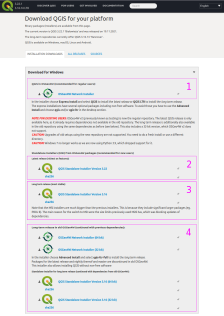

Когато човек види и осъзнае безкрайните възможности, които ГИС предоставя, веднага си задава въпроса - А може ли и аз? Отговорът е да, защото QGIS е отворен продукт, който всеки може да инсталира безплатно.

Трябва да се признае обаче, че страницата за изтегляне на QGIS за Windows изглежда малко объркващо с толкова много възможности.

## Важни особености при инсталацията на QGIS

Както всяка друга голяма програма, така и QGIS разчита на множество различни несвързани софтуерни проекти, за да може да изпълнява своите функции. Сред най-известните са Qt (откъдето идва и Q-то в името), GDAL, GEOS, GRASS GIS и още много други. Част от тези програми (или софтуерни пакети) могат да съществуват сами за себе си и да се използват като отделни програми (GDAL, GRASS GIS).

Можем да си представим софтуерните пакети като различни блокчета Lego, които се комбинират по различен начин и се получават различни фигури. В нашия случай искаме отделните парченца Lego да се сглобят по такъв начин, че да получим определена фигура, в нашия случай QGIS. Въпросът е дали искаме да си купим готова сглобена и **залепена** Lego фигура или да си закупим Lego блокчетата с много подробни инструкции за сглабяне, което ще позволи и да направим наши собствени фигурки?

.](img/qgis_lego.jpg)

Обратно извън метафората с Lego. И двата варианта имат своите преимущества и недостатъци - първия е по-лесен за постигане и управление, но изисква инсталацията на една и съща програма няколкократно (напр. GDAL не може да бъде ползват извън QGIS). Наличието на една и съща програма в операционната система с различни версии обаче може да я повреди. Втория вариант, ако се прави ръчно, е по-труден за постигане, управление и предпазване от грешки, но гарантира оптимално използване на ресурсите и гъвкавост.

Именно за улеснение на втория вариант съществува OSGeo4W - програма за управление на пакети с географски софтуер. OSGeo4W ни позволява да инсталираме различни програми с отворен код в точно желаната версия, за да настроим перфектната за нас система. За наше улеснение настройките по подразбиране на OSGeo4W ще ни исталират QGIS без да се налага да разбираме в детайли обясненото до момента.

Обобщение накратко:

- **Самостоятелна инсталация на QGIS** - всички необходими пакети за стартиране на QGIS са вградени. Получавате точно това, което сте си инсталирали, което означава, че не може да разширявате функционалността на QGIS с допълнителни пакети. Подходящ само за най-начинаещите потребители.

- **OSGeo4W инсталация на QGIS** - всички необходими пакети на QGIS ще се инсталират поотделно. Инсталацията им е автоматична, благодарение на мениджъра на пакети **OSGeo4W**. Той ще проследи за правилните версии на отделните пакети. Инсталацията като отделни пакети позволява да се използват не само в QGIS, но и допълнителни инструменти за пълен и гъвкав ГИС анализ.

## Описание на страницата за изтегляне на QGIS

Тъй като QGIS e свободен софтуер, може да бъде изтеглен абсолютно безплатно от официалната страница [тук](//qgis.org/en/site/forusers/download.html). Автоматично ще се отваря секцията за инсталацията на нашата операционна система, в случая Windows.

В розово са оградени различните опции за инсталация, които накратко могат да бъдат обобщени в:

1. **OSGeo4W Network Instsaller** - ще изтегли изпълним файл с OSGeo4W, който ще изтегли и инсталира всички необходими пакети. Препоръчва се за всички потребители.
2. **QGIS Standalone Installer Version 3.xx** - ще изтегли изпълним файл за самостоятелна инсталация на QGIS на последната версия. Използва се само ако OSGeo4W инсталацията не е минала успешно или се нуждаем от няколко различни версии на QGIS на компютъра.
3. **QGIS Standalone Installer Version 3.yy** - ще изтегли изпълним файл за самостоятелна инсталация на QGIS на последната версия с удължена поддръжка (по-долу e обяснено какво означава това). Използва се само ако OSGeo4W инсталацията не е минала успешно или се нуждаем от няколко различни версии на QGIS на компютъра.
4. **Стари и силно непрепоръчителни начини за инсталация на QGIS** - тази секция не бива да се ползва, освен ако не сте много напреднал потребител.

### QGIS Latest release (richest on features) или Long term release repository (most stable)

От изображенитео на екрана по-горе имаме избор между последната версия (по-големи числа, например 3.22) и Long term release (LTR) версия (по-малки числа, например 3.16). Освен ако сме срещнали проблеми при работата с последната версия или управляваме система с десетки компютри с QGIS, няма причина да изберем версията с удължена поддръжка.

## Инсталация с OSGeo4W

< предстои >

## Самостоятелна инсталация на QGIS

1. Уверяваме се, че нямаме инсталиран QGIS на нашия компютър. В `Add or remove programs` търсим за QGIS и ако открием инсталирана версия я премахваме.
2. Изтегляме изпълнимия файл на инсталатора на QGIS от [тук](//qgis.org/en/site/forusers/download.html). В замисимост дали искаме последната или LTR версия, избираме съответно `(2)` или `(3)` от снимката на сайта по-горе.
4. Стартираме изтегления `QGIS-OSGeo4W-3.16.15-1-Setup-x86_64.exe` (първите три числа може и да са различни) и следваме настройките по подразбиране.
4. Потвърждаваме, че инсталацията е завършила успешно, ако открием `QGIS` в старт менюто.
5. Готово!

{! includes/troubleshoot.md !}
