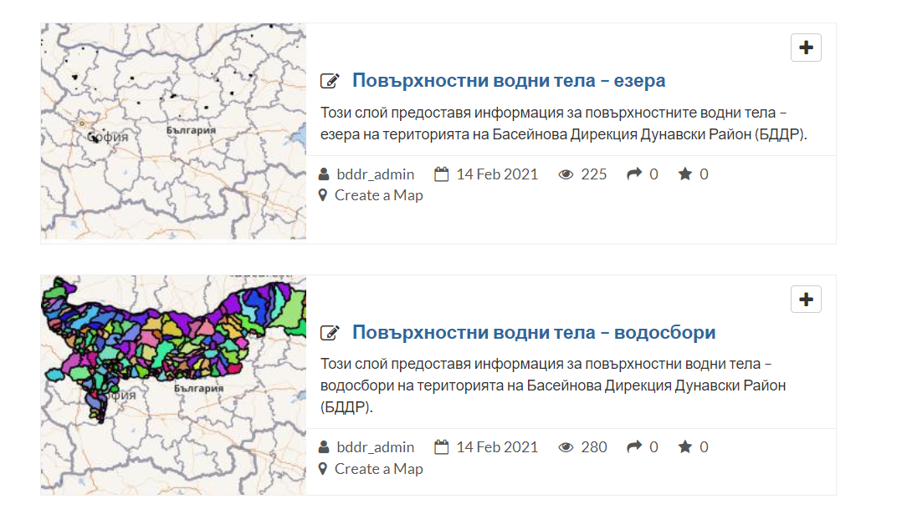

# GeoNode

GeoNode (джионоуд) е система за управление на геопространствено съдържание, платформа за управление и публикуване на геопространствени данни. Платформата позволява на неспециализирани потребители да споделят данни и да създават интерактивни уеб карти, дашборди, да се показват интерактивни презентации чрез карти, снимки, текст и видео.

Инструментите за управление на данни, вградени в GeoNode, позволяват интегрирано създаване на данни, метаданни и визуализация на карти. Всеки набор от данни в системата може да бъде споделен публично или ограничено, за да позволи достъп само на определени потребители. Социални функции като потребителски профили и системи за коментиране и оценяване позволяват развитието на общности около всяка платформа, за да се улесни използването, управлението и контролът на качеството на данните.

Geonode е проектиран да бъде гъвкава платформа, която разработчиците на софтуер могат да разширяват, модифицират или интегрират, за да отговорят на изискванията в собствените си приложения. Платформата е базирана на утвърдени и широко използвани технологии като Django, [GeoServer](./geoserver.md), [PostgreSQL](./postgresql.md)/[PostGIS](./postgis.md).

## Какво може Geonode?

- Зареждане на ГИС данни в платформата за преглед без необходимост от настолен ГИС софтуер или ГИС познания.
- Визуализация на данни чрез уеб базиран "визуален каталог на ГИС данни".
- Богати възможности за търсене на данни по категории (съгласно ISO19115 класификация на категориите), ключови думи, географски признак и др.
- Възможности за създаване и споделяне на уеб ГИС карти, уеб ГИС дашборди и уеб ГИС интерактивни презентации.
- Възможност за автоматична връзка към други портали и интегриране на данни на база уеб ГИС услуги (съгласно спецификации на OpenGeoSpatialConcortium).
- Директна интеграция/връзка с настолни ГИС софтуери (QGIS).

## Галерия

Примерни приложения на Geonode по света може да намерите в [GeoNode официалната галерия](https://geonode.org/gallery/).

Примерни приложения на Geonode в България:

## Как да инсталирам?

Инсталацията на Geonode много зависи от обема данни (растерни/векторни), настройките за кеширане на уеб услуги (GeoWebCache), броя публикувани уеб услуги и респективно броя потребители. Минималните изисквания са сървър (виртуален/клауд базиран или физически) с:

- 8GB RAM (силно препоръчително е 16GB за продуктова среда);
- 2.2GHz процесор с 4 ядра;
- 30GB дисково пространство (запазено за операционната система и самия портал, допълнително място спрямо изискванията на пространствените данни);
- Препоръчително е поне 100GB пространство и силно препоръчителна 64-битова среда, под Линукс (latest Ubuntu LTS).

За пълни инструкции за инсталация вижте [официалното ръководство на GeoNode](https://docs.geonode.org/en/master/install/basic/index.html).

## Външни връзки

- Основна страница на проекта: https://geonode.org
- Официално хранилище: https://github.com/GeoNode/geonode
- Официално демо приложение: http://master.demo.geonode.org
- GeoNode Wiki страница: https://github.com/GeoNode/geonode/wiki
- Възможност за подаване/проследяване на проблеми/бъгове/нови изисквания: https://github.com/GeoNode/geonode-project/issues
