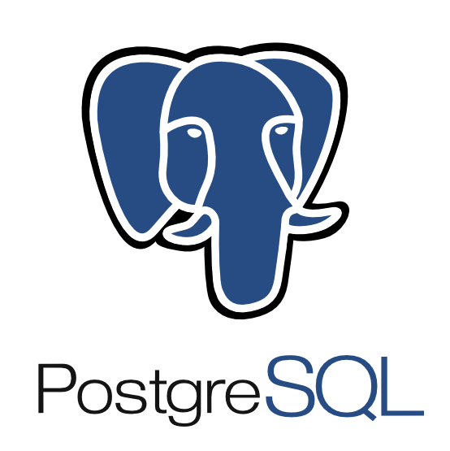

# PostgreSQL

> Най-напредничавата релационна база данни с отворен код в света!

PostgreSQL (постгрескюел), postgres (постгрес), или просто pg (пиджи) e сред най-популярните SQL бази данни.
​
Тя е обектно-релационна система за управление на база данни с отворен код. Използва и разширява езика SQL, като го надгражда с много допълнителни функции. Началото на PostgreSQL започва от 1986 г. като част от проекта POSTGRES в Калифорнийския университет в Бъркли и има повече от 35 години активно развитие на основната платформа.

Обикновено под PostgreSQL се има предвид единствено сървъра на базата данни. За свързване с базата данни е необходим клиент за осъществяване на връзка и изпращане на заявки, сред най-популярните са `psql` и `pgAdmin4`.

PostgreSQL има безупречна репутация със своята доказана архитектура, надеждност, цялостност на данните, богат набор от функции, разширяемост и отдаденост към общността с отворен код. Базата данни се стреми да предоставя ефективни и иновативни решения на всички основни операционни системи. Съвместим е с ACID от 2001 г. и има множество разширения като този за геопространствени бази данни - PostGIS.

## Какво може PostgreSQL?

- Висока поддръжка на SQL стандарта: Освен простите SQL заявки, в PostgreSQL може да се правят сложни заявки като съединения, подзапитвания и window функции. Оптимизаторът му непрекъснато се развива, за да подобрява производителността на заявките и ускори времето за бързодействие.

- Богат избор от типове данни - Освен стандартните типове данни като цели числа и низове, PostgreSQL предоставя поддръжка за разширени типове данни като JSON, XML, масиви и геометрични типове, което ви позволява да съхранявате и манипулирате сложни данни ефективно.
В допълнение базата предоставя дефиниране на собствени типове спрямо нуждите на потребителя и приложението.

- Възможност за адаптация и разширения - PostgreSQL предлага богата екосистема от разширения, които ви позволяват да настроите базата данни според конкретните си нужди. Тези разширения варират от методи за индексиране до типове данни и процедурни езици. Едно от най-широкоизползваните разширения, особено в света на ГИС, е [PostGIS](./postgis.md).

- ACID транзакции - Atomicity (неделимост), Consistency (непротиворечивост), Independency (независимост), Durability (необратимост) са в основата на транзакционния модел за почти всички SQL бази данни и PostgreSQL е чудесен пример за стриктно следване на тези правила.

- Скалируемост - PostgreSQL може да се мащабира от малки, еднородни разпределения до големи, разпределени архитектури. Функции като разделение на таблиците, изпълнение на заявки паралелно и поддръжка на репликация ви помагат да скалирате базата данни според нуждите на приложението.

- Отворен код - Изходният код на базата данни е изцяло отворен и подлежи на разучаване и подобрение от всеки.

- Богата екосистема - Клиенти за свързване с PostgreSQL бази данни може да се открие на практически всички програмни езици и в най-различни софтуерни продукти.

## Допълнителни инструменти

- [`psql`](https://www.postgresql.org/docs/current/static/app-psql.html) - Стандартният клиент за свързване с PostgreSQL бази данни, поддържан от същите разработчицит като основния продукт. Обикновено се инсталира заедно със PostgreSQL базата данни.

- [`pgcli`](https://www.pgcli.com/) - Python клиент за свързване с PostgreSQL бази данни с вградено оцветяване на SQL синтаксиса и автоматично завършване на синтактичните изрази.

- [`pgAdmin4`](https://www.pgadmin.org/) - Най-популярният и богат на функционалности графичен клиент за администрация и разработка на PostgreSQL бази данни.

## Как да инсталирам?

PostgreSQL е наличен за изтегляне и инсталация на различни операционни системи и платформи.

Инструкции за инсталация могат да се открият в [официалната страница на PostgreSQL](https://www.postgresql.org/download/).

## Външни връзки

- Страница: https://www.postgresql.org/
- Документация: https://www.postgresql.org/docs/current/
- Изходен код: https://wiki.postgresql.org/wiki/Working_with_Git
