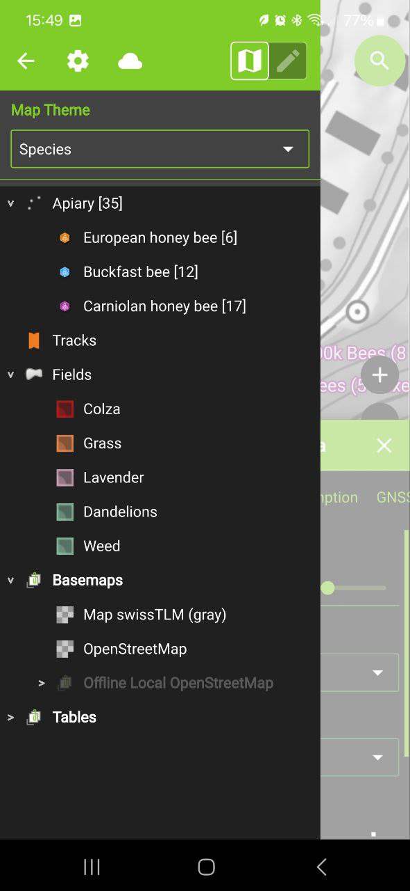
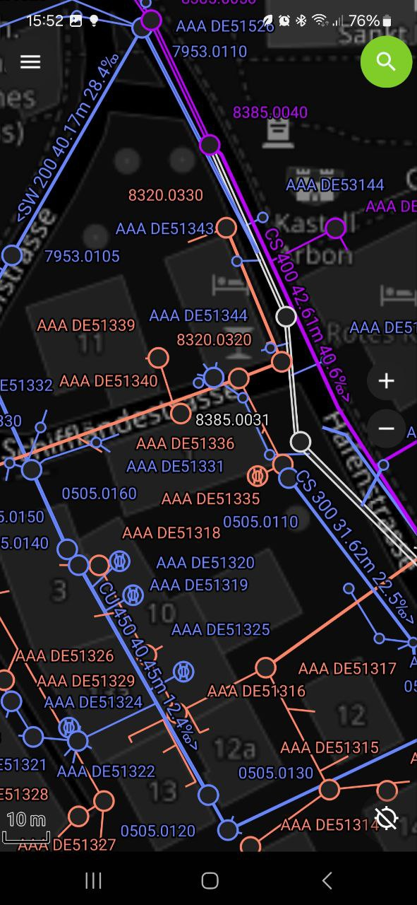

# QField

QField (кюфийлд) е мобилно приложение за събиране на теренни данни, създадено като допълнение на [QGIS](./qgis.md). Приложението предлага опростен и оптимизиран за екрани с докосване, но функционален графичен интерфейс към функционалностите на QGIS. Позволява потребителите да събират, редактират, визуализират и аналализират геопространствени данни на терен, дори и при липса на интернет връзка. Сферите на прилагане са практически безкрайни: кадастър, наблюдение на околната среда, управление на подземна и надземна инфраструктура, провеждане на анкетни проучвания, събиране на сензорни данни и т.н.

Приложението се разработва от [OPENGIS.ch](https://opengis.ch) със същия свободен GPL лиценз като QGIS, което гарантира, че приложението е абсолютно свободно и безплатно. Работи на Android, iOS, Windows, MacOS и Linux операционна система.

## Какво може QField?

### Пълна интеграция с QGIS

QField поддържа пълна интеграция с QGIS във всички свои аспекти - файлов формат, рендиране на символогията на слоевете, рендиране на формулярите за редакция на слоевете, изрази за валидация и т.н.

Това гарантира, че видяното в QGIS ще е същото като видяното в QField и обратно.

### Интеграция с външни GNSS устройства

### Събиране на данни в режим без интернет връзка

Едно от забележителните свойства на QField е възможността да работи без интернет връзка дори когато данните се съхраняват в онлайн слоеве като WFS и [PostGIS](./postgis.md). Това е критично важно за теренни проучвания в отдалечени райони или като цяло райони със слабо или липсващо покритие на комуникационните мрежи.

### Настройка на формуляри

QField използва същите настройки на формулярите за попълване на данни за обектите в слоевете като QGIS. Това ползволява както презициране на вида данни - число, текст, снимка, двоична стойност, така и контролата, с която това се случва: текстово поле, слайдер, падащо меню, чекбокс - но в допълнение и валидацията на полето: число в даден интервал, текст не по-дълъг от N символа и т.н. Освен това формулярите поддържат табове, оцветяване, показване и скриване спрямо дадено условие и т.н.

### Проследяване на движението

В QField може да се запише движението на позициониращото устройството в пространството, като записва нови обекти в слой с геометрия точки или линия.

### Събиране на данни от външни устройства

QField поддържа комуникацията както с вграденото, така и с външни позициониращи устройства посредством NMEA протокол. По тази начин QField намира приложение дори и при събирането на презицни геодезически замервания.

### QFieldCloud

За централизирано съхранение на множестно QField проекти и управление на достъпа до тях е разработена допълнителната онлайн услуга [QFieldCloud](./qfieldcloud.md), която е директно интегрирана с QField. Освен синхронизация на данните, QFieldCloud позволява съхранение на данни, планиране на теренна работа, управление на екипи и прецизен достъп до определени части от проекта.

## Примери

{ height="300px" }

## Допълнителни инструменти

- [**QFieldSync**](https://plugins.qgis.org/plugins/qfieldsync/) - QGIS плъгин, който улеснява настройката и прехвърлянето на данни от QField в QGIS.

## Как да инсталирам?

QField може да се инсталира директно от [Google Play Store](https://play.google.com/store/apps/details?id=ch.opengis.qfield&hl=bg) и [Apple App Store](https://apps.apple.com/si/app/qfield-for-qgis/id1531726814).

[Натисни за инсталиране на QField](httpps://qfield.org/get){.md-button}

Конкретна версия на QField може да се [изтегли директно от GitHub](https://github.com/opengisch/QField/releases).

## Външни връзки

- Официална страница - https://qfield.org
- Документация - https://docs.qfield.org
- Изходен код - https://github.com/opengisch/QField
