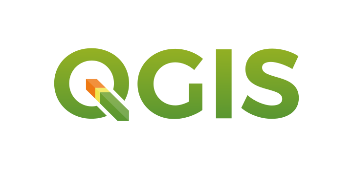
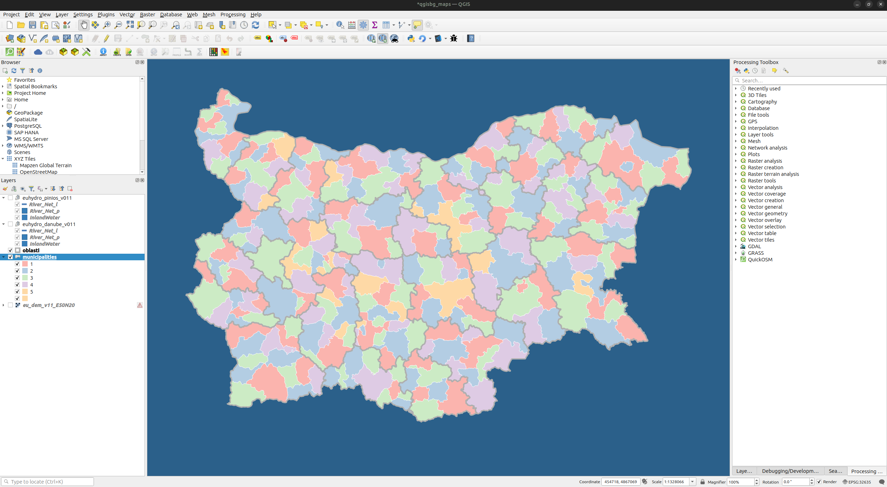

# QGIS



QGIS e професионален свободен и отворен ГИС софтуер за създаване, редактиране, визуализация, анализ и публикуване на геопространствена информация.
QGIS е платформено независим и работи с операционни системи Windows, macOS, Linux, а благодарение на [QField](./qfield.md) и на Android и iOS.
Поддържа множество векторни, растерни и бази данни формати и функционалности благодарение на [GDAL/OGR](./gdal.md).
QGIS е преведен на множество езици, което го прави достъпен за разнообразна потребителска база по целия свят.


## Какво може QGIS Desktop?

- Отворен код: свободен и отворен софтуер завинаги, всеки може свободно да се учи и работи с QGIS, когато и където поиска.
- Широка поддръжка на формати от пространствени данни: поддържа почти всички векторни и растерни формати чрез [GDAL/OGR](./gdal.md), включително облаци от точки и mesh слоеве.
- 3D визуализация: поддържа 3D визуализация на пространствени данни, като позволява на потребителите да създават и изследват 3D карти.
- Оформление за печат: QGIS предоставя мощен дизайнер на оформлението за печат, който помага за създаване на висококачествени карти, отчети и атласи.
- Редакция на данни: удобни инструменти за редакция на пространствени и атрибутивни данни.
- Формуляри: изграждане на персонализирани формуляри за попълване и редакция на данни с възможности за валидация.
- Неограничена симвология: неограничени възможности за символи, цветове и форми за представяне на пространствени данни - статични, анимирани, генерирани.
- Растерен анализ: QGIS предлага инструменти за растерни анализи, включително растерна алгебра, анализ на терена и класификация.
- Разширени инструменти за анализ: QGIS предлага над 200 алгоритъма за пространствен анализ, а още много други могат да се инсталират допълнително чрез системата от разширения.
- Създаване на процеси и модели: QGIS има мощен графичен инструмент за автоматизиране на процеси и модели от множество стъпки.
- Интеграция с други ГИС: чрез QGIS може да се използват функционалности и алгоритми от [GDAL/OGR](./gdal.md), [GRASS GIS](./grass.md), SAGA GIS, R, Orfeo Toolbox и много други.
- Разширения: потребителите могат да избират над 2000 безплатни приставки, разработени от общността, за улесняване на работата във всяка част от пространствените науки.
- Изрази: възможност за динамичен контрол на почти всеки аспект от визуализацията на базата на динамични променливи и изрази.
- Скриптове на Python: използвай най-разпространения език в геопространствените науки за автоматизиране и персонализация на функционалностите на QGIS.
- Взаимодействие: оперативна съвместимост с друг ГИС софтуер чрез стандартни формати като WMS и WFS, включително и с неотворени стандарти.
- Поддръжка на време: вградена поддръжка за филтриране и агрегиране по време, възможност за създаването на анимация на траектории или динамика на стойности.
- ГННС интеграция: потребителите могат да свързват ГНСС устройства към QGIS за събиране и проследяване на данни в реално време.
- Сензори: четене на данни от умни устройства и сензори като датчици за качество на въздуха, радиационен фон и др.
- Редактиране на топология: поддържа инструменти за редактиране на топологична редакция.
- QGIS общността: QGIS има голяма, активна и дружелюбна общност от потребители и разработчици, които осигуряват поддръжка, ръководства и документация на различни езици.


## Галерия




## Допълнителни инструменти

### Какво е QGIS Server?

QGIS Server дава възможност на потребителите да създават динамични и интерактивни решения за уеб картографиране, като прави пространствените данни достъпни и приложими за широк кръг потребители.
Той поддържа различни формати данни, включително векторни и растерни данни, което позволява разпространението на сложна пространствена информация.
QGIS Server предлага възможности за персонализиране на оформлението на картите, стилизирането и интерактивните функции, което осигурява гъвкавост на приложенията за уеб картографиране.
Комуникацията с QGIS Server може да се случи по OGC стандартите като WFS, WMS и WMTS.


### Какво е `qgis_process`?

`qgis_process` е инструмент от командния ред за изпълнение на алгоритми от командния ред.
Позволява автоматизиране на процеси чрез писане на кратки скриптове.

Пример:

=== "Команда"
    ```
    qgis_process run qgis:topologicalcoloring --distance_units=meters --area_units=m2 --ellipsoid=EPSG:7030 --INPUT='/home/qgisbg/site/maps/data.gpkg|layername=municipalities' --MIN_COLORS=5 --MIN_DISTANCE=0 --BALANCE=0 --OUTPUT=TEMPORARY_OUTPUT
    ```
=== "Изход"
    ```
    ----------------
    Inputs
    ----------------

    BALANCE:	0
    INPUT:	/home/qgisbg/site/maps/data.gpkg|layername=municipalities
    MIN_COLORS:	5
    MIN_DISTANCE:	0
    OUTPUT:	TEMPORARY_OUTPUT

    Using ellipsoid:	EPSG:7030
    Using distance unit:	meters
    Using area unit:	square meters

    0...10...20...30...40...50...60...70...806 colors required
    ...90...100 - done.

    ----------------
    Results
    ----------------

    OUTPUT:	Colored_48a48d35_bf55_47d9_be64_6d195ed60a9b
    ```

## Как да инсталирам?

QGIS е свободен продукт и може да бъде изтеглен и инсталиран от официалния сайт.
Как да инсталираш може да прочетеш в [официалната документация на английски език за инсталация](https://www.qgis.org/en/site/forusers/alldownloads.html) или да се обърнеш към материалите на български език в QGIS.bg.

- [Как да инсталираме QGIS в Windows?](https://qgisbg.github.io/docs/wiki/qgis/kak_da_instalirame_qgis_v_windows/)
- [Как да инсталирам QGIS в Debian/Ubuntu?](https://qgisbg.github.io/docs/wiki/qgis/kak_da_instalirame_qgis_v_ubuntu/)


## Каква е връзката между QGIS и Quantum GIS?

Преди версия 3 QGIS се нарича Quantum GIS.


## Общност

QGIS се разработва от гостоприемна общност от отдадени доброволци и организации, отворена за хора от всички раси, вероизповедания, полове и сфери на живота.

[Може да се включиш и ти!](https://www.qgis.org/en/site/getinvolved/index.html) Как?

- Отговаряш на въпроси на други потребители със затруднения.
- Документираш QGIS.
- Превеждаш QGIS.
- Разработиш ново QGIS разширение.
- Разработиш функционалности по ядрото на QGIS.
- Подкрепиш финансово проекта.
- Споделяш опита си.


## Външни връзки

- Страница: https://qgis.org
- Документация: https://docs.qgis.org
- Изходен код: https://github.com/QGIS/QGIS
- Телеграм канал: https://t.me/joinchat/Aq2V5RPoxYYhXqUPoxRWPQ
